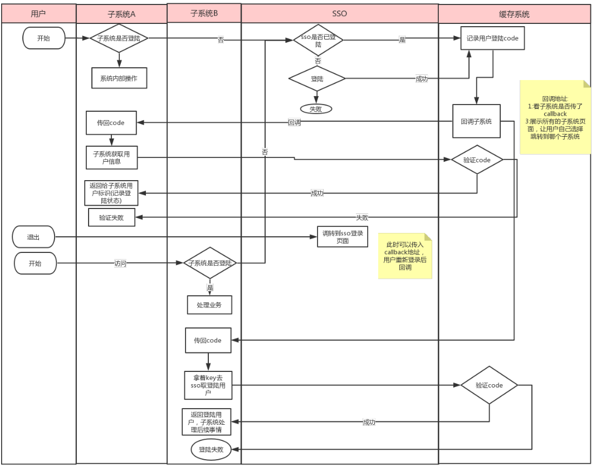

# 单点登录系统对接规范 V4.0

## 一. 文档说明

本文档主要说明子系统对接统一登录系统的交互流程和接口开发规范

### 1.1 流程说明



### 1.2 协议格式

编码： 统一使用 utf-8 编码进行传输、加密、解密、数据转换等
协议： 所有接口都是通过 sdk 请求，所有响应内容都是 都被解析为struct对象或error; 

### 1.3 参数签名

请求参数必须通过签名的方式保证数据的合法性和未被篡改， 参数 sign 为签名串，构建方式为: 所有请求参数组成键值对（如:channel_no=csh)通过 ASCII 顺序连接字符串, 并且不使用任何链接字符， 最后拼接secret, 使用 md5 加密生成签名串。如:

``` json
secret := "5c3f7743e352b8a677d44396ad24ba63"
sign := md5.Encrypt("identssorequest_no194182214638126timestamp20160512101002" + secret) 
```

某些字段的值是 json(如下面的data), 则应使用压缩后的json格式。如：

``` json
{
    "userid": "123456",
    "password": "5c3f7743e352b8a677d44396ad24ba63",
    "full_name": "张三",
    "data": [
        {
            "title": "******",
        }
    ]
}
```

拼接顺序:

```json 
secret := "5c3f7743e352b8a677d44396ad24ba63"
raw := `data[{"title":"20元抵扣券"}]failed_code000failed_msg查询成功order_id1507917362062278request_no194182214638126statusSUCCESS`

sign := md5. Encrypt(raw + secret)

``` 

## 二. 接口规范

该接口文档是基于sdk对接, 以下提供的请求路径为sdk方法名; 

``` Go
//sdk引入方式
import "github.com/micro-plat/sso/sso"

var App = hydra.NewApp(
	hydra.WithPlatName("sso_new", "新版sso"),
	hydra.WithSystemName("mgrserver", "sso单点登录管理系统"),
	hydra.WithUsage("单点登录管理系统"),
	hydra.WithServerTypes(http.Web),
	hydra.WithClusterName("prod"))

func init() {
    //绑定注册接口
    sso.Bind(App)

    //初始化接口调用配置
    sso.Config(SsoApiHost, Ident, Secret)

    	//每个请求执行前执行
	App.OnHandleExecuting(func(ctx hydra.IContext) (rt interface{}) {
		//验证jwt并缓存登录用户信息
		if err := sso.CheckAndSetMember(ctx); err != nil {
			return err
		}
		return nil
    })
}
```

### 2.1  ⽤⼾登录验证以及返回⽤⼾信息(CheckCodeLogin)

由于现在是跳转登录的⽅式, 因此sso回调⼦系统地址后，⼦系统要调用此接口验证登录的合性

#### 2.1.1 请求参数

|参数 |类型|可空|示例|说明|
| -------------|:--------------:|:--------------:|:--------------:|:--------------:|
|code| string| 否|123456|调转登录返回给⼦系统的code|

请求示例:

``` Go
import "github.com/micro-plat/sso/sso"

func main(){
    loginInfo,err:= sso.CheckCodeLogin("code")
    if err != nil {
        fmt.Println("err:",err)
        return
    }

    fmt.Println("loginInfo struct:",loginInfo)
}

```

#### 2.1.2 响应参数：

|参数 |类型|可空|示例|说明|
| -------------|:--------------:|:--------------:|:--------------:|:--------------:|
|UserID         |string |否| 123456 |⽤⼾标识|
|UserName       |string |否| admin |⽤⼾名称|
|FullName       |string |否| 张三 |⽤⼾全名称|
|SysIdent       |string |否| sso |系统编码|
|RoleID         |int    |否| 1 |角色id|
|Status         |int    |否| 0 |用户状态 0: 启用  1: 锁定 2: 禁用|
|RoleName       |string |否| 管理员 |⻆⾊名称|
|SystemID       |int    |否| 0 |系统编号|
|IndexURL       |string |否| http://0.0.0.0:8080/ssocallback |登录回调地址|
|ExtParams      |string |是|  |⽤⼾扩展参数(⼀个json对象)|
|Source         |string |是| Wx |用户来源|
|SourceID       |string |是| 12345 |用户来源id|
|LastLoginTime |string  |否| 2020-01-01 12:12:00 |最后登录时间|

### 2.2  根据⽤⼾名获取⽤⼾信息(GetUserInfoByName)

#### 2.2.1 请求参数

|参数 |类型|可空|示例|说明|
| -------------|:--------------:|:--------------:|:--------------:|:--------------:|
|userName| string| 否|admin|用户名|

请求示例:

``` Go
import "github.com/micro-plat/sso/sso"

func main(){
    userInfo,err:= sso.GetUserInfoByName("admin")
    if err != nil {
        fmt.Println("err:",err)
        return
    }

    fmt.Println("userInfo struct:",userInfo)
}

```

#### 2.2.2 响应参数：

|参数 |类型|可空|示例|说明|
| -------------|:--------------:|:--------------:|:--------------:|:--------------:|
|UserID         |string |否| 123456 |⽤⼾标识|
|UserName       |string |否| admin |⽤⼾名称|
|FullName       |string |否| 张三 |⽤⼾全名称|
|WxOpID         |string |是| openid |微信openid|
|Mobile         |string |否| 1820032215 |联系电话|
|Email          |string |是| admin@100bm.cn |邮箱|
|Status         |string |否| 0 |用户状态 0: 启用  1: 锁定 2: 禁用|
|ExtParams      |string |是|  |⽤⼾扩展参数(⼀个json对象)|

### 2.3  获取⽤⼾⼦系统的菜单数据(GetUserMenu)

#### 2.3.1 请求参数

|参数 |类型|可空|示例|说明|
| -------------|:--------------:|:--------------:|:--------------:|:--------------:|
|userID| string| 否|123456|用户编号|

请求示例:

``` Go
import "github.com/micro-plat/sso/sso"

func main(){
    menusArry,err:= sso.GetUserMenu("123456")
    if err != nil {
        fmt.Println("err:",err)
        return
    }

    fmt.Println("menusArry []struct:",menusArry)
}

```

#### 2.3.2 响应参数：

返回值为以下对象数组

|参数 |类型|可空|示例|说明|
| -------------|:--------------:|:--------------:|:--------------:|:--------------:|
|ID         |string |否| 1 |菜单标识|
|Name       |string |否| 用户管理 |菜单名称|
|Level      |string |否| 1 |级次|
|IsOpen     |string |否| 0 |是否展开 (0: 展开 1: 关闭)|
|Icon       |string |是| fa fa-users-test-info |图标|
|SystemID   |string |否| 0 |系统编号|
|Parent     |string |否| 0 |⽗级编号|
|Path       |string |是|  |⽤⼾扩展参数(路由地址)|
|Sortrank   |string |否| 1 |排序编号|
|Children   |[]当前对象 |是|  |⽤⼾扩展参数(⼦菜单)|

### 2.4  获取⽤⼾⼦系统的菜单数据(GetSystemInfo)

#### 2.4.1 请求参数

|参数 |类型|可空|示例|说明|
| -------------|:--------------:|:--------------:|:--------------:|:--------------:|
|ident| string| 否|sso|系统标识码|

请求示例:

``` Go
import "github.com/micro-plat/sso/sso"

func main(){
    sysInfo,err:= sso.GetSystemInfo("ssonew")
    if err != nil {
        fmt.Println("err:",err)
        return
    }

    fmt.Println("sysInfo struct:",sysInfo)
}

```

#### 2.4.2 响应参数：

|参数 |类型|可空|示例|说明|
| -------------|:--------------:|:--------------:|:--------------:|:--------------:|
|ID         |string |否| 123456 |系统标识|
|Ident      |string |否| sso |系统ident(英⽂名称)|
|Name       |string |否| 张三 |系统名称|
|Theme      |string |是| openid |主题样式|
|Layout     |string |是| app-aside-fixed |⻚⾯布局样式|
|IndexUrl   |string |否| http://127.0.0.1:8080/ssocallback |登录回调地址|
|Logo       |string |是| http://static.100bm.cn/logo.png |系统图标地址|

### 2.5  获取用户可访问的子系统(GetUserOtherSystems)

#### 2.5.1 请求参数

|参数 |类型|可空|示例|说明|
| -------------|:--------------:|:--------------:|:--------------:|:--------------:|
|userID| string| 否|123456|用户编号|

请求示例:

``` Go
import "github.com/micro-plat/sso/sso"

func main(){
    sysArry,err:= sso.GetUserOtherSystems("12456")
    if err != nil {
        fmt.Println("err:",err)
        return
    }

    fmt.Println("sysArry []struct:",sysArry)
}

```

#### 2.5.2 响应参数：

|参数 |类型|可空|示例|说明|
| -------------|:--------------:|:--------------:|:--------------:|:--------------:|
|ID         |string |否| 123456 |系统标识|
|Ident      |string |否| sso |系统ident(英⽂名称)|
|Name       |string |否| 张三 |系统名称|
|Theme      |string |是| openid |主题样式|
|Layout     |string |是| app-aside-fixed |⻚⾯布局样式|
|IndexUrl   |string |否| http://127.0.0.1:8080/ssocallback |登录回调地址|
|Logo       |string |是| http://static.100bm.cn/logo.png |系统图标地址|

### 2.6  获取某来源所有的用户列表(GetAllUser)

#### 2.6.1 请求参数

|参数 |类型|可空|示例|说明|
| -------------|:--------------:|:--------------:|:--------------:|:--------------:|
|source| string| 否|wx|用户来源|
|sourceID| string| 否|123456|用户来源id|

请求示例:

``` Go
import "github.com/micro-plat/sso/sso"

func main(){
    usersArry,err:= sso.GetAllUser("source","sourceID")
    if err != nil {
        fmt.Println("err:",err)
        return
    }

    fmt.Println("usersArry []struct:",usersArry)
}

```

#### 2.6.2 响应参数：

|参数 |类型|可空|示例|说明|
| -------------|:--------------:|:--------------:|:--------------:|:--------------:|
|UserID         |string |否| 123456 |⽤⼾标识|
|UserName       |string |否| admin |⽤⼾名称|
|FullName       |string |否| 张三 |⽤⼾全名称|
|WxOpID         |string |是| openid |微信openid|
|Mobile         |string |否| 1820032215 |联系电话|
|Email          |string |是| admin@100bm.cn |邮箱|
|Status         |string |否| 0 |用户状态 0: 启用  1: 锁定 2: 禁用|
|ExtParams      |string |是|  |⽤⼾扩展参数(⼀个json对象)|

### 2.7  忘记并修改密码(ForgetPwd)

#### 2.7.1 请求参数

|参数 |类型|可空|示例|说明|
| -------------|:--------------:|:--------------:|:--------------:|:--------------:|
|source| string| 否|wx|用户来源|
|sourceID| string| 否|123456|用户来源id|
|possword| string| 否|e10adc3949ba59abbe56e057f20f883e|密码 md5|

请求示例:

``` Go
import "github.com/micro-plat/sso/sso"

func main(){
    err:= sso.ForgetPwd("source","sourceID","possword")
    if err != nil {
        fmt.Println("err:",err)
        return
    }

    fmt.Println("success")
}

```

#### 2.7.2 响应参数：

返回值为error, 如果error为空则标识操作成功

### 2.8  获取用户有权限的Tags(GetUserTags)

#### 2.8.1 请求参数

|参数 |类型|可空|示例|说明|
| -------------|:--------------:|:--------------:|:--------------:|:--------------:|
|UserID| string| 否|123456|用户编号|
|tags| string| 否|tag1, tag2, tag3|验证的tag列表|

请求示例:

``` Go
import "github.com/micro-plat/sso/sso"

func main(){

    tagMaps, err:= sso.GetUserTags("UserID","tags")
    if err != nil {
        fmt.Println("err:",err)
        return
    }

    fmt.Println("tagMaps []map:",tagMaps)

}
```

#### 2.8.2 响应参数：

返回值为以下格式的[]map

|参数 |类型|可空|示例|说明|
| -------------|:--------------:|:--------------:|:--------------:|:--------------:|
|tag| string| 否|tag1|系统标识|
|display| bool| 否|true|是否有权限 true: 有  false: 无|

### 2.9  添加用户(AddUser)

#### 2.9.1 请求参数

|参数 |类型|可空|示例|说明|
| -------------|:--------------:|:--------------:|:--------------:|:--------------:|
|userName   | string| 否|admin|用户名|
|mobile     | string| 否|18200358452|联系电话|
|fullName   | string| 否|张三|用户全名|
|targetIdent| string| 否|sso|系统编号|
|source     | string| 是|wx|用户来源|
|sourceID   | string| 是|123456|用户来源|
|sourceSecrect| string| 否|e10adc3949ba59abbe56e057f20f883e|签名密钥(对应的系统的签名密钥)|

请求示例:

``` Go
import "github.com/micro-plat/sso/sso"

func main(){
     err:= sso.AddUser("userName", "mobile", "fullName", "targetIdent", "source", "sourceSecrect" , "sourceID" , 123)
    if err != nil {
        fmt.Println("err:",err)
        return
    }

    fmt.Println("success")
}
```

#### 2.9.2 响应参数：

返回值为error, 如果error为空则标识操作成功

### 2.10  系统登录(Login)

#### 2.10.1 请求参数

|参数 |类型|可空|示例|说明|
| -------------|:--------------:|:--------------:|:--------------:|:--------------:|
|userName   | string| 否|admin|用户名|
|password     | string| 否|e10adc3949ba59abbe56e057f20f883e|密码 md5|

请求示例:

``` Go
import "github.com/micro-plat/sso/sso"

func main(){
     loginInfo,err:= sso.Login("userName", "password")
    if err != nil {
        fmt.Println("err:",err)
        return
    }

    fmt.Println("loginInfo struct:",loginInfo)
}
```

#### 2.10.2 响应参数：

|参数 |类型|可空|示例|说明|
| -------------|:--------------:|:--------------:|:--------------:|:--------------:|
|UserID         |string |否| 123456 |⽤⼾标识|
|UserName       |string |否| admin |⽤⼾名称|
|FullName       |string |否| 张三 |⽤⼾全名称|
|SysIdent       |string |否| sso |系统编码|
|RoleID         |int    |否| 1 |角色id|
|Status         |int    |否| 0 |用户状态 0: 启用  1: 锁定 2: 禁用|
|RoleName       |string |否| 管理员 |⻆⾊名称|
|SystemID       |int    |否| 0 |系统编号|
|IndexURL       |string |否| http://0.0.0.0:8080/ssocallback |登录回调地址|
|ExtParams      |string |是|  |⽤⼾扩展参数(⼀个json对象)|
|Source         |string |是| Wx |用户来源|
|SourceID       |string |是| 12345 |用户来源id|
|LastLoginTime |string  |否| 2020-01-01 12:12:00 |最后登录时间|

### 2.11  修改密码(ChangePwd)

#### 2.11.1 请求参数

|参数 |类型|可空|示例|说明|
| -------------|:--------------:|:--------------:|:--------------:|:--------------:|
|userID   | string| 否|1231456|用户名|
|expassword     | string| 否|e10adc3949ba59abbe56e057f20f883e|原密码, md5|
|newpassword   | string| 否|e10adc3949ba59abbe56e057f20f883e|新密码, md5|

请求示例:

``` Go
import "github.com/micro-plat/sso/sso"

func main(){
    err:= sso.ChangePwd(123456, "expassword", "newpassword")
    if err != nil {
        fmt.Println("err:",err)
        return
    }

    fmt.Println("success")
}
```

#### 2.11.2 响应参数：

返回值为error, 如果error为空则标识操作成功

## 三、附件

### 3.1 接口错误码

所有的错误码都在返回的error对象中

|错误码	 |结果说明|错误码	 |结果说明|
| -------------|:--------------:| -------------|:--------------:|
| 403           |登录失效       | 907           |用户名或密码错误|
| 404           |服务不存在     | 908           |用户原密码错误|
| 406            |参数错误       | 909           |绑定信息错误(绑定用户微信账号)|
| 500           |系统错误       | 910           |用户已绑定微信|
| 510           |系统错误       | 911           |绑定超时(微信绑定)|
| 901           |系统被锁定       | 912           |用户还未绑定微信账户|
| 902           |用户被锁定       | 913           |验证码为空|
| 903           |用户被禁用       | 914           |验证码过期|
| 904           |登录出错, 稍后再试| 915           |验证码错误|
| 905           |用户不存在| 916           |二维码超时(用户系统生成的二维码时间过期)|
| 906           |没有相关系统权限| 917           |一个微信只能绑定一个账户|
