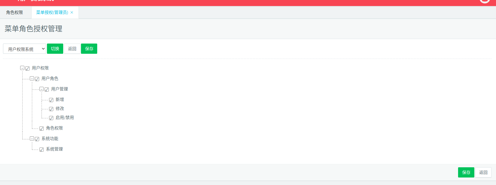
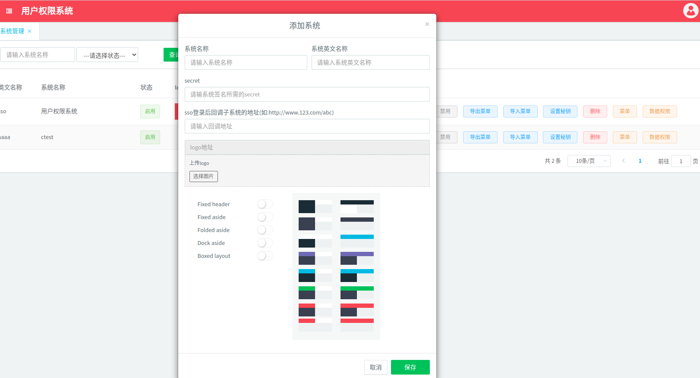

# 单点登录系统

## 一. 项目结构

### 1.1 登录服务(loginserver)

其中包含对外开放api接口和统一登录web页面

### 1.2 用户权限管理服务(mgrserver)

用户权限后台管理系统

### 1.3 sdk

包含前端sdk-js和honduran接口调用sdk

## 二. 项目支持

### 2.1 支持数据库

mysql

### 2.2 支持缓存

redis, gocache, memcache

### 2.3 支持的消息队列

redis, mqtt

### 2.4 运行环境

window, linux, macOS

## 三. 系统操作流程展示

### 3.1 请求子系统(系统未登录)

直接跳转到统一登录页面


### 3.2 登录成功

直接回调到子系统跳转登录前访问的页面

### 3.3 用户管理页面


#### 3.3.1 微信绑定页面


#### 3.3.2 用户添加和编辑页面


### 3.4 角色管理页面


#### 3.4.1 角色添加和编辑页面


#### 3.4.2 菜单授权页面



#### 3.4.3 数据授权页面


### 3.5 系统管理页面


#### 3.5.1 添加和编辑系统页面



#### 3.5.2 密钥设置页面


#### 3.5.3 系统菜单管理页面


#### 3.5.4 系统数据权限管理页面


## 四. 发布使用中可能遇到的问题

### 4.1 jwt服务端不能接受到

#### 4.1.1 nginx 配置问题, 拦截了__sso_jwt__

#### 4.1.2 跨域问题(zookeeper-> header中设置(正常如下)))

``` json
{
    "Access-Control-Allow-Origin": "*",
    "Access-Control-Allow-Methods": "GET,POST,PUT,DELETE,PATCH,OPTIONS",
    "Access-Control-Allow-Headers": "X-Requested-With,Content-Type,__sso_jwt__,X-Requested-Id",
    "Access-Control-Allow-Credentials": "true",
    "Access-Control-Expose-Headers":"__sso_jwt__"
}
```

### 4.2 登录回调失败

查看注册中心app配置是否正常, 必须包含如下三个字段:

``` json
{	
    "secret":"311124b57e468ff88e4f1c8743354314", //这个必须和数据库中的一样
    "sso_api_host":"http://api.sso.18jiayou1.com:6689", //loginserver的api接口地址
    "ident":"17sup" //创建系统时取的英文名
}
```

### 4.3 登录成功后不能回跳到子系统中

    系统中回调地址没有设置，在用户权限管理系统中加上地址：如: http://web.xx.100bm.cn/ssocallback
