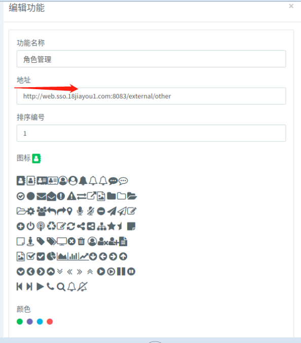

# 使用说明

#### 1. 引入(导入到本地)

要重新安装菜单组件,相关使用说明请看github.com/micro-plat/nav-menu
npm install nav-menu@latest

安装与sso对接的js
npm install qxnw-sso@latest


在main.js中引入 如下
``` js

import {ssoHttpConfig} from 'qxnw-sso';

var config = process.env.service;
var ssocfg = ssoHttpConfig(config.apiHost, "localStorage", config.ssoWebHost, config.Ident);

//将sso和http都挂在vue对象中，方便使用
Vue.prototype.$sso = ssocfg.sso; 
Vue.prototype.$http = ssocfg.http;
```

参数|类型|说明
--|:--:|--:
apiHost|string| 子系统apihost
storagePlace |string|jwt存储方式 [localStorage, sessionStorage],cookie请传空, 最好用 localStorage
ssoWebHost |string| 线下:http://login.sso.18jiayou1.com, 线上：http://login.sso.18jiayou.com
ident|string|子系统ident

```
说明: 由于将原来的get,post进行了包装,因此要将main.js文件中原来http的方法及引用去掉【切记】如: Vue.prototype.$post等
```
---

#### 2. 所有http的交互

``` js
在vue页面中使用时有点变化，要调整成这样, 原来都是 $post,$patch,$fetch,$put,$del(这些都要替换)

this.$post => this.$http.post;
this.$put => this.$http.put;
this.$get => this.$http.get;
this.$del => this.$http.del;
this.$fetch => this.$http.get

原则就是在前面加一个http
```
---

#### 3. sso web对接相关

##### 3.1 增加一个回调页面 如: ssocallback.vue
同时要增加一个路由: /ssocallback (顶级，不能在menu路由下面)
原来登录路由 /login 就不需要了

``` js
<template>
</template>
<script>
  export default {
    data () {
      return {
      }
    },
    mounted(){
      this.validSsoLogin();
    },
    methods:{
      validSsoLogin(){
          this.$http.post("/sso/login/verify",{code: this.$route.query.code})
            .then(res =>{
                this.$sso.changeRouteAfterLogin(this.$router, res.user_name, res.role_name);
            }).catch(err => {
              console.log(err);
            });
      }
    }
  }
</script>
```

##### 3.3 处理修改密码和退出,以及菜单控件的修改 (一般是 menu.vue)
``` js
这个页面去除的代码有点多，关于修改密码都要去掉,要升级nav-menu控件，前面提过
修改后大概如下, 要根据子系统情况而定, 结构差不多一致就可以了:
<template>
  <div id="app">
    <nav-menu
      :menus="menus"
      :copyright="copyright"
      :themes="themes"
      :logo="logo"
      :systemName="systemName"
      :userinfo="userinfo"
      :pwd="pwd"
      :items="items"
      :signOut="signOut"
      ref="NewTap"
    >
    </nav-menu>
  </div>
</template>

<script>
  import navMenu from 'nav-menu'; // 引入
  export default {
    name: 'app',
    data () {
      return {
        logo: "",
        copyright: new Date().getFullYear() + "admin-web", //版权信息
        themes: "", //顶部左侧背景颜色,顶部右侧背景颜色,右边菜单背景颜色
        menus: [{}],  //菜单数据
        systemName: "用户权限系统",  //系统名称
        userinfo: {name:'wule',role:"管理员"},
        items:[], //用户有权限的其他子系统
        indexUrl: "/user/index",  这个是进入系统后默认加载的页面
      }
    },
    components:{ //注册插件
      navMenu
    },
    created(){
      this.getMenu();
      this.getSystemInfo();
    },
    mounted(){
      document.title = "用户权限系统";
      this.userinfo = JSON.parse(localStorage.getItem("userinfo"));
    },
    methods:{
      pwd(){
        this.$sso.changePwd();
      },
      signOut() {
        this.$sso.signOut();
      },
      getMenu(){
        this.$http.get("/sso/member/menus/get")
          .then(res => {
            this.menus = res;
            this.$refs.NewTap.open("用户管理", this.indexUrl);    //这个名称要根据自己系统修改
            this.getUserOtherSys();
          })
          .catch(err => {
            console.log(err)
          });
      },
      getSystemInfo() {
        this.$http.get("/sso/system/info/get")
        .then(res => {
          this.themes = res.theme;
          this.systemName = res.name;
          this.logo = res.logo;
        }).catch(err => {
          console.log(err);
        })
      },
      getUserOtherSys() {
        this.$http.get("sso/member/systems/get")
        .then(res => {
         this.items = this.$sso.transformSysInfo(res);
        })
        .catch(err => {
          console.log(err);
        })
      },
    }
  }
</script>

<style scoped>

</style>
```

##### 3.4 去除多余的代码

#####3.5 跨系统调用，而且只显示那个系统的子页面
```
首先要在被调用系统增加一个菜单,必须为最顶级(要与 / menu 同一个级次)如：
    {
      path: '/external/other',
      name: 'other',
      component: roleindex,
    },
    {
    path: '/',
    name: 'menu',
    component: menu,
    meta:{
      name:"用户权限系统"
    },
    children: [{
      path: 'user/index',
      name: 'userindex',
      component: userindex
    }]

而且要以 /external开头 如: /external/other
说明: component 要指向 系统中真正的 vue页面

-------------------------------------------------------------------
在要展示的系统中 通过后台用户系统增加一个功能菜单,这个菜单很特殊，它指向的是其他
系统的地址，如: http://web.sso.18jiayou.com/external/other
```


```
http://web.sso.18jiayou.com/external/other 前面是host, 要加上http,  /external/other就是被调用系统的路由地址
```


